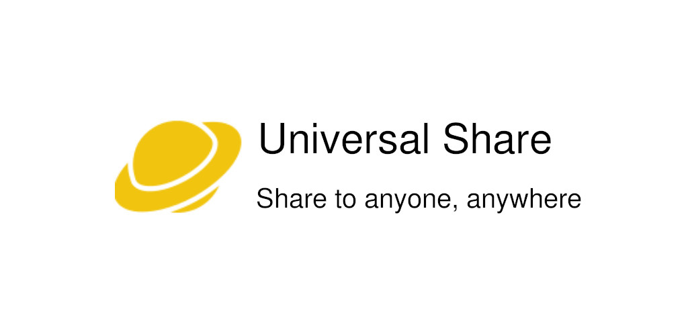
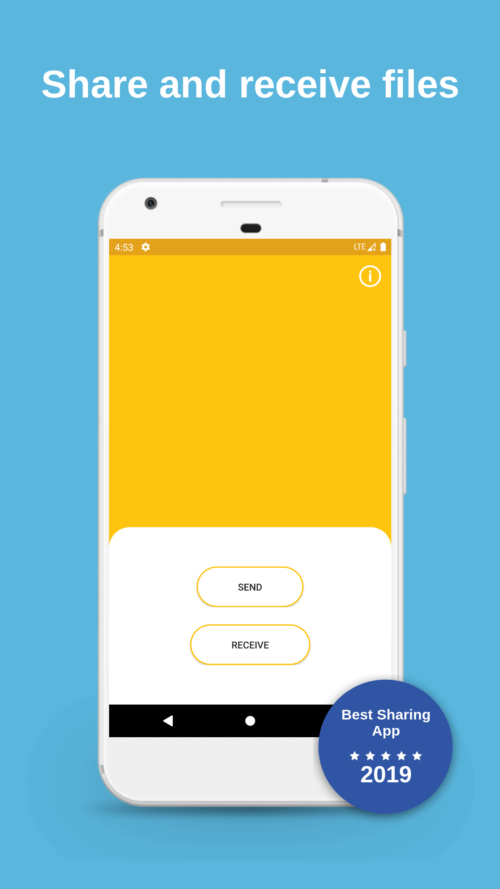
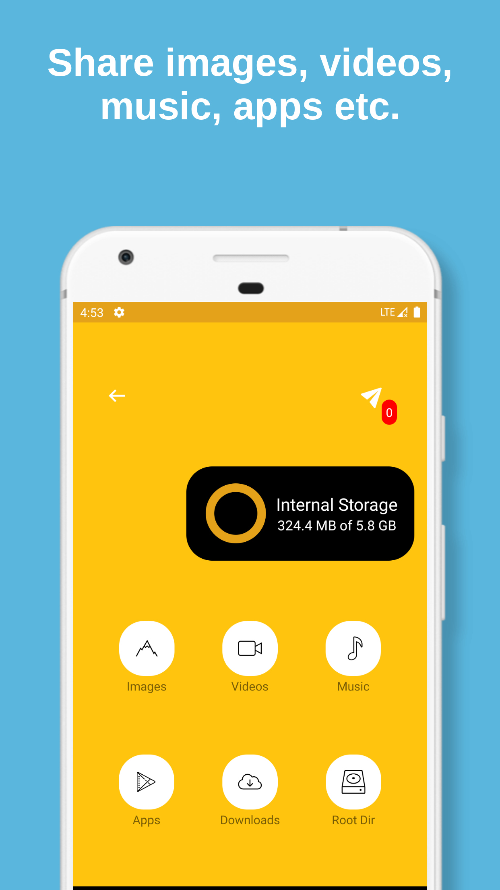
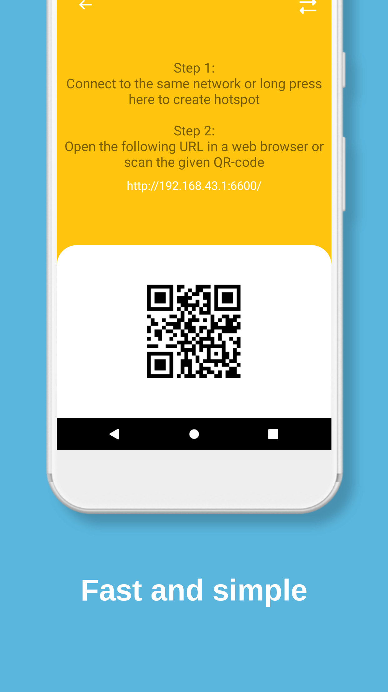
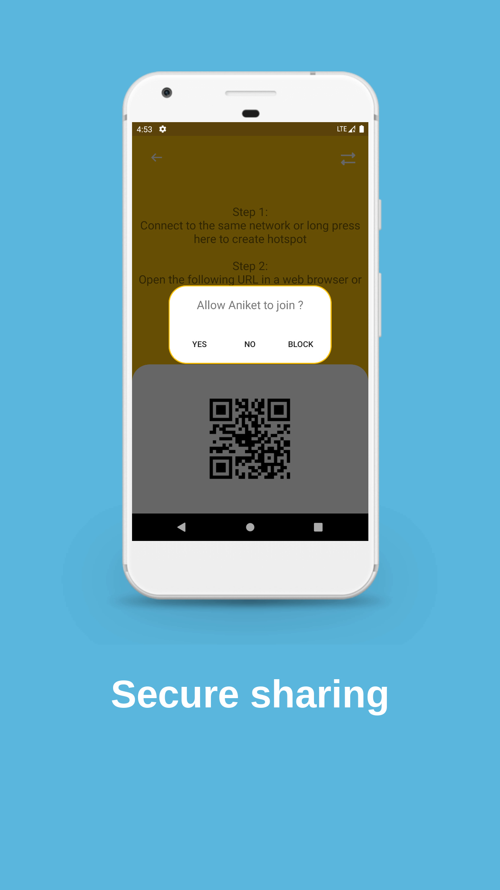

# Universal Share
> This project is stale. The codebase dates back to 2017 when I was 14. So obviously, the code quality is awful.

Universal Share implements a simple multi-threaded HTTP server that can be used to share files independent of any platform. It offers a blazingly fast, cross-platform experience without the need for any companion app.

Share and receive files from any device having a web browser and Wi-Fi, with easy to use user interface.

# Screenshots

## License & Copyright

Copyright (C) 2017 Aniket Prajapati

Licensed under the **[MIT LICENSE](LICENSE)**

## Contributors

+ [Aniket Prajapati](https://aniketprajapati.me)
  @[prajapati.ani306@gmail.com](mailto:prajapati.ani306@gmail.com)
